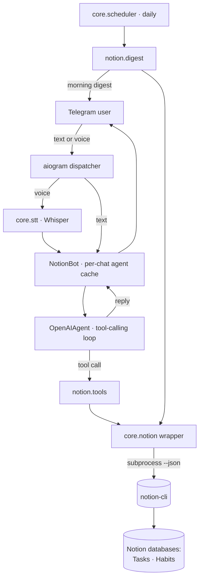

# notion-task-bot

A Telegram bot that turns a plain sentence — typed **or spoken** — into the
right CRUD call against your Notion **task tracker** and **habit tracker**, then
confirms what it did. It also sends a morning digest of the day's tasks.

> _"add Gym tomorrow, effort High"_ · _"what's on this week?"_ ·
> _"mark the trading review done"_ · _"отметь холодную воду на сегодня"_

## The sellable insight

**The LLM plans; a deterministic CLI executes.** The bot never talks to the
Notion API directly and never invents a schema. It exposes a small, typed
toolset (`create_task`, `find_tasks`, `update_task`, `complete_task`,
`archive_task`, plus habit tools) to an OpenAI agent whose system prompt pins
the **exact** allowed option values (Type, Effort, Status) and habit slugs. The
agent decides _which_ tool and _what_ arguments; a separate command-line tool
(`notion-cli`) owns authentication and performs the write.

That separation is what makes it robust and portable:

- **No hallucinated fields.** The model is told the enum values and is
  forbidden from inventing new ones — so it can't write `Status: "almost done"`.
- **Auth lives in one place.** No Notion token in this repo; the CLI holds it.
- **Two databases, two toolsets.** Tasks and habits are different Notion
  databases with disjoint tools, so the agent can't cross the wires.
- **Voice for free.** A voice message is transcribed by Whisper, then flows
  through the exact same agent path as text.
- **It stays up.** Every turn runs inside a resilience wrapper: a transient
  OpenAI / STT / CLI failure is logged and alerted, but never kills the
  long-poll process.
- **Per-chat memory.** Each chat gets its own agent instance with a
  conversation buffer, so follow-ups ("and move it to Friday") resolve in
  context.

## Prerequisite: `notion-cli`

This bot is a **conversational front-end** over an external command-line tool,
`notion-cli`, which owns your Notion integration token and the task/habit
database ids. The bot shells out to it (`core/notion.py`) and parses its
`--json` output — it does **not** reimplement Notion auth.

You need a `notion-cli` on the bot host that:

- lives at `~/bin/notion-cli` (or set the path via the `cli=` argument in
  `core/notion.py`), and
- supports these commands, each accepting `--json`:
  - `notion-cli tasks add <title> [--date --type --effort --status]`
  - `notion-cli tasks list [--today --date --date-from --date-to --status]`
  - `notion-cli tasks get|update|complete|delete <id> [...]`
  - `notion-cli habits today|check <slug> [--off --date]|stats [--days N]`

Any tool exposing that surface works. The option values in
`notion/tools.py` (`TYPE_VALUES`, `EFFORT_VALUES`, `STATUS_VALUES`,
`HABIT_SLUGS`) must match your own database schema — edit them to fit.

## Architecture



Everything runs in **one** asyncio process: aiogram long-polling for live
messages, plus a once-a-day digest task.

## Setup

Requires Python 3.14+ and [uv](https://docs.astral.sh/uv/), plus a working
`notion-cli` (see above).

```bash
git clone <your-fork-url> notion-task-bot
cd notion-task-bot
uv sync --dev

cp .env.example .env      # then fill in real values
uv run python -m notion --check      # validate config, exit 0 if OK
```

Run it:

```bash
uv run python -m notion              # long-polling + daily digest
uv run python -m notion --digest-once  # send one digest now and exit (cron-friendly)
```

Optional live end-to-end smoke (read-only; skips cleanly without creds):

```bash
uv run python -m notion.live_smoke
```

## Configuration

| Variable                  | Required | Purpose                                                        |
|---------------------------|----------|----------------------------------------------------------------|
| `TELEGRAM_BOT_TOKEN_NOTION` | yes    | Bot token from [@BotFather](https://t.me/BotFather).           |
| `OPENAI_API_KEY`          | yes      | Powers the agent **and** Whisper voice transcription.          |
| `TELEGRAM_CHAT_ID`        | yes      | Owner chat id(s) for failure alerts + the digest.              |
| `NOTION_MODEL`            | no       | Override the chat model (a sensible default is built in).      |

Config is read from a project-local `.env` (see `core/config.py`). A missing
required key fails loud, naming the key — the process never starts with empty
credentials.

## Testing

```bash
uv run pytest -q      # unit tests (no network, no real Notion/Telegram/OpenAI)
uv run ruff check .
```

The tests fake the OpenAI client, the Telegram client and `notion-cli`, so they
run fully offline and deterministically.

## Deployment

A systemd unit template is in `deploy/notion-task-bot.service`. It relies on the
built-in resilience for transient errors and `Restart=on-failure` only for hard
exits.

## License

MIT — see [LICENSE](LICENSE).
