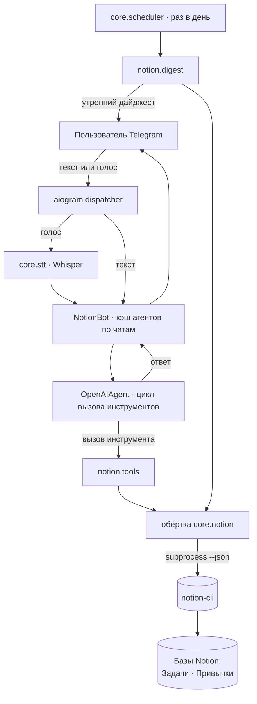

# notion-task-bot

Телеграм-бот, который превращает обычную фразу — набранную **или сказанную
голосом** — в правильный CRUD-вызов к вашему Notion-трекеру **задач** и
**привычек**, а затем подтверждает, что именно сделал. Плюс утренний дайджест
задач на день.

> _«добавь Зал на завтра, усилие High»_ · _«что на этой неделе?»_ ·
> _«отметь торговый разбор выполненным»_ · _«отметь холодную воду на сегодня»_

## Ключевая идея

**LLM планирует, детерминированный CLI исполняет.** Бот никогда не обращается к
Notion API напрямую и не выдумывает схему. Он даёт OpenAI-агенту маленький
типизированный набор инструментов (`create_task`, `find_tasks`, `update_task`,
`complete_task`, `archive_task` и инструменты привычек), а системный промпт
жёстко фиксирует **точные** допустимые значения (Type, Effort, Status) и слаги
привычек. Агент решает, *какой* инструмент и *с какими* аргументами вызвать, а
отдельная утилита командной строки (`notion-cli`) владеет авторизацией и
выполняет запись.

Именно это разделение делает бота надёжным и переносимым:

- **Никаких выдуманных полей.** Модели названы enum-значения, и выдумывать новые
  запрещено — она не запишет `Status: "почти готово"`.
- **Авторизация в одном месте.** В этом репозитории нет Notion-токена — им
  владеет CLI.
- **Две базы — два набора инструментов.** Задачи и привычки — разные базы Notion
  с непересекающимися инструментами, агент не перепутает.
- **Голос из коробки.** Голосовое сообщение расшифровывается Whisper и идёт по
  тому же пути, что и текст.
- **Бот не падает.** Каждый ход обёрнут в resilience-обёртку: временный сбой
  OpenAI / STT / CLI логируется и уходит алертом, но не роняет long-poll процесс.
- **Память на чат.** У каждого чата свой экземпляр агента с буфером диалога, так
  что уточнения («и перенеси на пятницу») понимаются в контексте.

## Обязательное условие: `notion-cli`

Этот бот — **разговорный фронтенд** над внешней утилитой командной строки
`notion-cli`, которая владеет интеграционным токеном Notion и id баз задач и
привычек. Бот вызывает её как подпроцесс (`core/notion.py`) и парсит вывод
`--json` — он **не** реализует авторизацию Notion сам.

На хосте бота нужен `notion-cli`, который:

- находится по пути `~/bin/notion-cli` (или укажите путь через аргумент `cli=` в
  `core/notion.py`), и
- поддерживает эти команды, каждая с флагом `--json`:
  - `notion-cli tasks add <title> [--date --type --effort --status]`
  - `notion-cli tasks list [--today --date --date-from --date-to --status]`
  - `notion-cli tasks get|update|complete|delete <id> [...]`
  - `notion-cli habits today|check <slug> [--off --date]|stats [--days N]`

Подойдёт любая утилита с таким интерфейсом. Значения в `notion/tools.py`
(`TYPE_VALUES`, `EFFORT_VALUES`, `STATUS_VALUES`, `HABIT_SLUGS`) должны совпадать
с вашей схемой баз — отредактируйте под себя.

## Архитектура



Всё работает в **одном** asyncio-процессе: aiogram long-polling для живых
сообщений плюс ежедневная задача-дайджест.

## Установка

Нужны Python 3.14+ и [uv](https://docs.astral.sh/uv/), а также рабочий
`notion-cli` (см. выше).

```bash
git clone <url-вашего-форка> notion-task-bot
cd notion-task-bot
uv sync --dev

cp .env.example .env      # затем впишите реальные значения
uv run python -m notion --check      # проверка конфига, выход 0 если всё ок
```

Запуск:

```bash
uv run python -m notion              # long-polling + ежедневный дайджест
uv run python -m notion --digest-once  # отправить один дайджест и выйти (для cron)
```

Опциональный live-смоук end-to-end (только чтение; без кредов аккуратно
пропускается):

```bash
uv run python -m notion.live_smoke
```

## Конфигурация

| Переменная                  | Обязательна | Назначение                                                |
|-----------------------------|-------------|-----------------------------------------------------------|
| `TELEGRAM_BOT_TOKEN_NOTION` | да          | Токен бота от [@BotFather](https://t.me/BotFather).       |
| `OPENAI_API_KEY`            | да          | Питает агента **и** расшифровку голоса Whisper.           |
| `TELEGRAM_CHAT_ID`          | да          | Chat id владельца для алертов и дайджеста.                |
| `NOTION_MODEL`              | нет         | Переопределить чат-модель (по умолчанию разумная).       |

Конфиг читается из локального `.env` (см. `core/config.py`). Отсутствие
обязательного ключа падает громко с его именем — процесс не стартует с пустыми
кредами.

## Тесты

```bash
uv run pytest -q      # юнит-тесты (без сети, без реального Notion/Telegram/OpenAI)
uv run ruff check .
```

Тесты подменяют OpenAI-клиент, Telegram-клиент и `notion-cli`, поэтому работают
полностью офлайн и детерминированно.

## Деплой

Шаблон systemd-юнита — в `deploy/notion-task-bot.service`. Он опирается на
встроенную устойчивость к временным сбоям, а `Restart=on-failure` — только на
случай жёсткого выхода.

## Лицензия

MIT — см. [LICENSE](LICENSE).
